# R-visualization
How to create publication quality plots using different R libraries


## Different libraries

Base R can create different simple plots like scatter ,histograms,boxplots,barplots etc with limited asethetics. To enhance the athestics, elegances and to create complex plots/graphs with reproducibility we can need to use specialised libraries. There are many specialised libraries in the public domain that can be used. In this module we will look into **gggplot2** and **patchwork**.


# R graphics using R base


**Scatter plot**

Scatter plot is created using function plot(). plot function needs 2 parameters X-axis and Y-axis

```
x <- 1:100
y <- log(x) + (x/100)^5
plot(x,y)
```
{ width=50% }


Customization of the plots
- points() to add points to an existing plot
- lines() to add a line to an existing plot
- col indicating the colour
- lwd indicating the line width
- lty indicating the line type
- pch indicating the plotting character (symbol)
```
lines(x,y+1)
points(x,y-1, type="b")
```
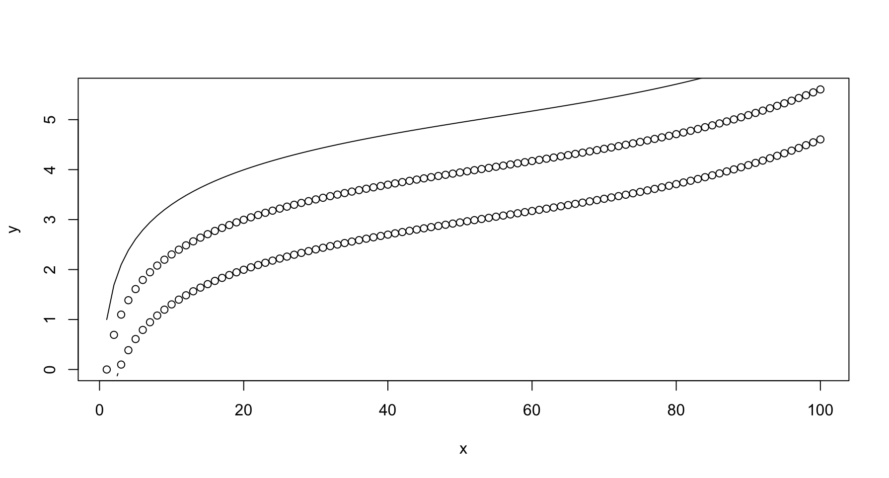{ width=50% }


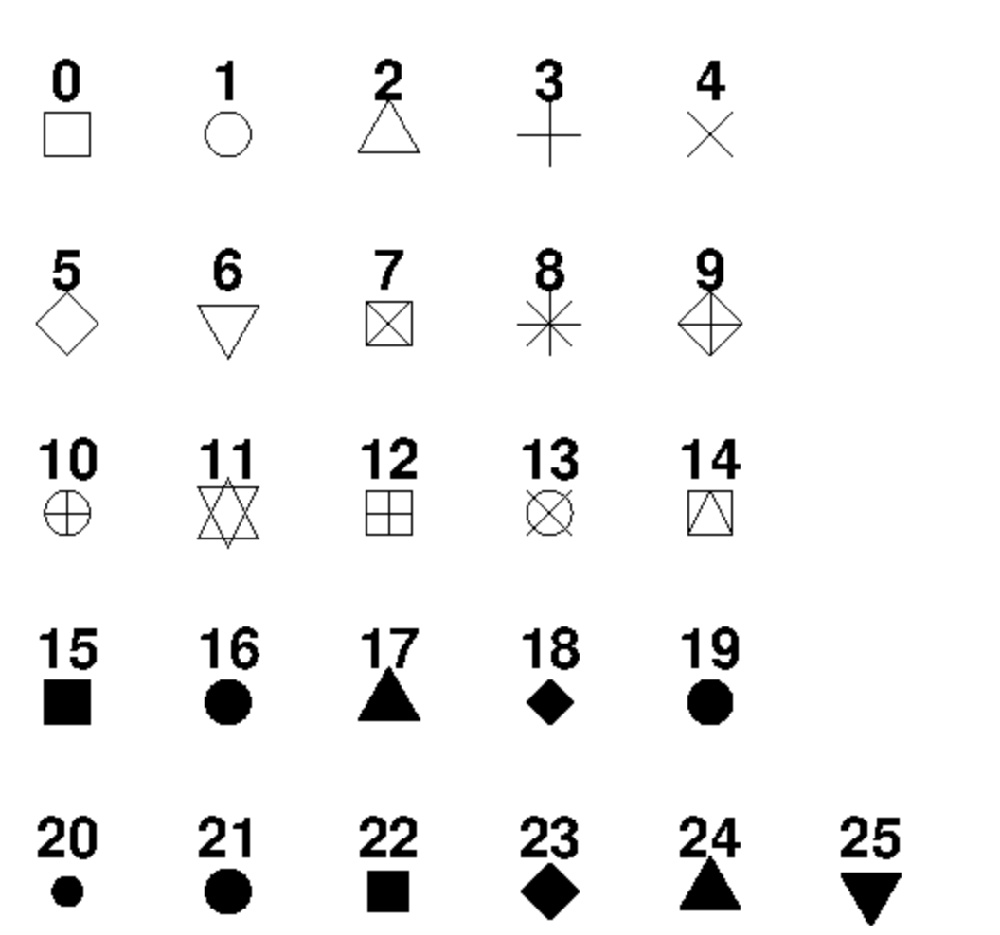{ width=50% }

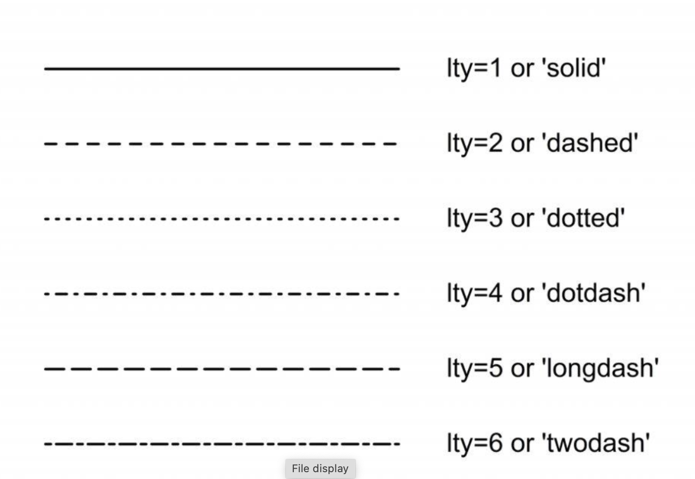{ width=50% }


### Adding color 

By default user can acess 100+ colurs by using function ***colours()***. More [info](www.nceas.ucsb.edu/~frazier/RSpatialGuides/colorPaletteCheatsheet.pdf)

```
x <- seq(0, 100, length.out=10)
y <- log(x) + (x/100)^5
plot(x,y, type="l", col="red",
ylim=c(1,7),
xlab="The variable x",
main ="x vs. y" )
lines(x, y+1, lwd=3,
lty="dashed", col="blue")
points(x, y-1, type="b", pch=15)

```

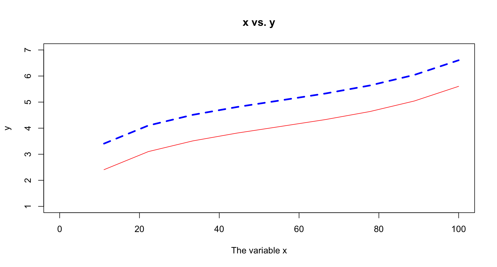{ width=50% }

**Adding legends**

```
x <- seq(0, 100, length.out=10)
y <- log(x) + (x/100)^5
plot(x,y, type="l", col="red",
     ylim=c(1,7),
     xlab="The variable x",
     main ="x vs. y" )
lines(x, y+1, lwd=3,
      lty="dashed", col="blue")
points(x, y-1, type="b", pch=15)


legend(x="bottomright",
       legend=c("red line",
                "blue line", "black line"),
       lty=c(1,2,1),
       pch=c(NA,NA,19),
       col=c("red", "blue", "black"),
       bg="gray90")
````


**abline**

To add multiple lines (vertically, horizontally or sloped) to an existing plot to show cutoffs,boundaries and also ti show fitting line to the data.

1. Adding horzontal line

```
data(airquality)
plot(airquality$Wind, airquality$Ozone, pch=20, xlab= "Wind (mph)", ylab="Ozone (ppb)")
abline(h=60, col="red", lty="dashed")

```

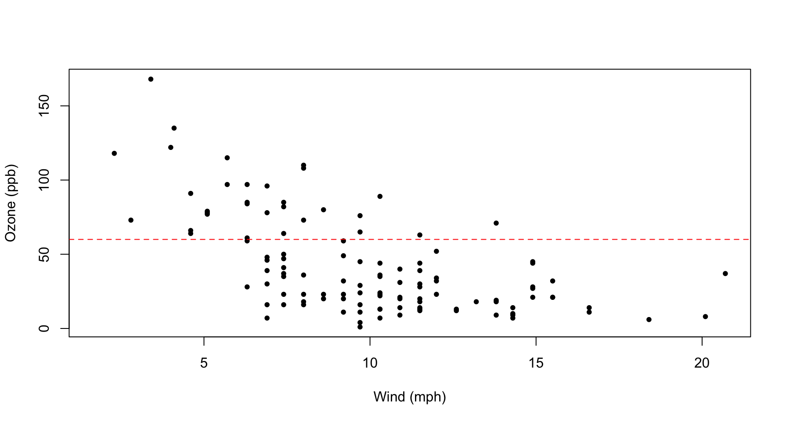{ width=50% }

2 . Adding vertical line 

```

abline(v = seq(0, 25, 5), col = "blue", lty = 4)

```

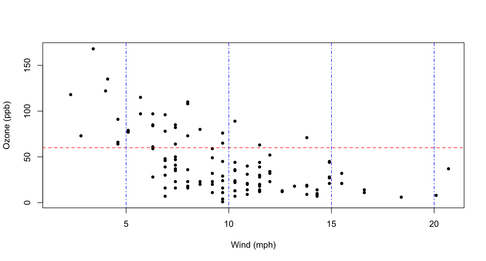{ width=50% }

seq function allow here to  generates a sequence of numbers from 0 to 25 in steps of 5.


3 . Adding Trend line 

```

abline(lm(airquality$Ozone ~ airquality$Wind), col=8, lwd=2)

```

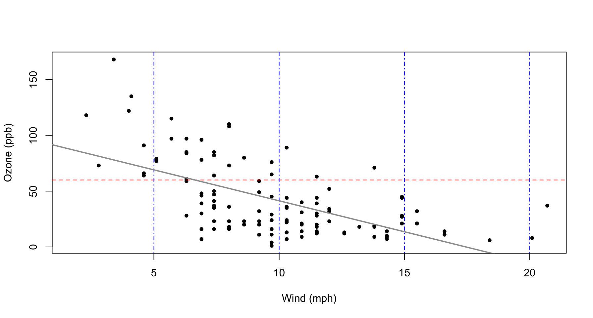{ width=50% }


**Histogram**

To create histogram R base uses function hist(). The generic function hist computes a histogram of the given data values. If plot = TRUE, the resulting object of class "histogram" is plotted by plot.histogram, before it is returned.

```
hist(airquality$Wind)

```

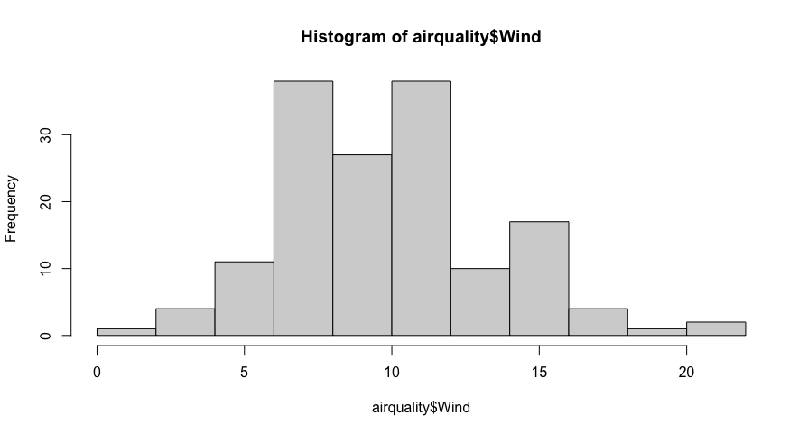{ width=50% }

Customization of the histogram

```
hist(airquality$Wind, freq=FALSE, main="Hist", col="grey") 
lines(density(airquality$Wind), Col="blue", lwd=2)
```

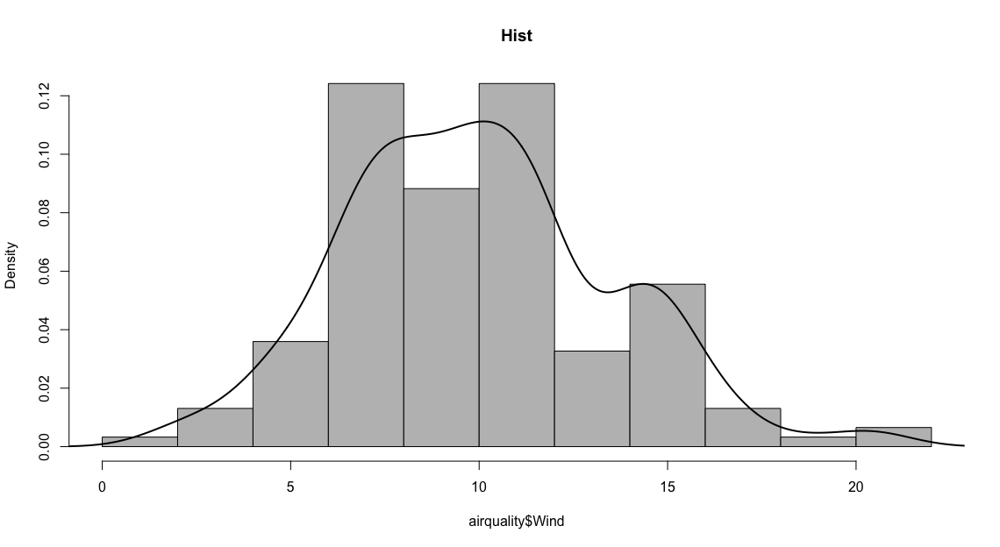{ width=50% }


**Boxplot**

Produce box-and-whisker plot(s) of the given (grouped) values.


```
     
boxplot(airquality$Ozone,ylab='airquality Ozone', col='white')    
```


# [Tidyverse](https://www.tidyverse.org)
Tidyverse is an ecosytem of R packages designed the usability of data which includes data wrangling,data manuplation,data managment and data plotting. Tidyverse achieves this by creating independent packages in its universe 

**1. ggplot2 :** ggplot2 (grammer of graphics) is a R package for data visulization

**2. dplyr   :** data manipulation

**3. tibble  :** data managment

**4: tidyr   :** data wrangling

 .... and many more

## 1. ggplot2

**ggplot2* is a versatile and powerful R package used for creating data visualizations with enhanced aesthetics.

**a. Installing and Loading ggplot2**

```
# install the complete tidyverse packages
install.packages("tidyverse")

# Alternatively, install just ggplot2:
install.packages("ggplot2")

# loading the ggplot2 library
library(ggplot2)

```
**Excercise 1***

Create a scatter plot  mpg vs horsepower (mpg ~ hp) from ***mtcars*** data and differentiate the points by cylinders

<details>
  <summary>Excercise 1 Answer</summary>
  
```
# Convert cyl to a factor : ensuring to consider this a categorical values
mtcars$cyl <- as.factor(mtcars$cyl)

# Create a color vector

colors <- c("red", "blue", "green")

# Plot mpg against hp with colors based on cyl

plot(mpg ~ hp, data = mtcars, col = colors[mtcars$cyl], cex = 1.2)

# Add legend

legend("topright", legend = levels(mtcars$cyl), col = colors, pch = 1)

```
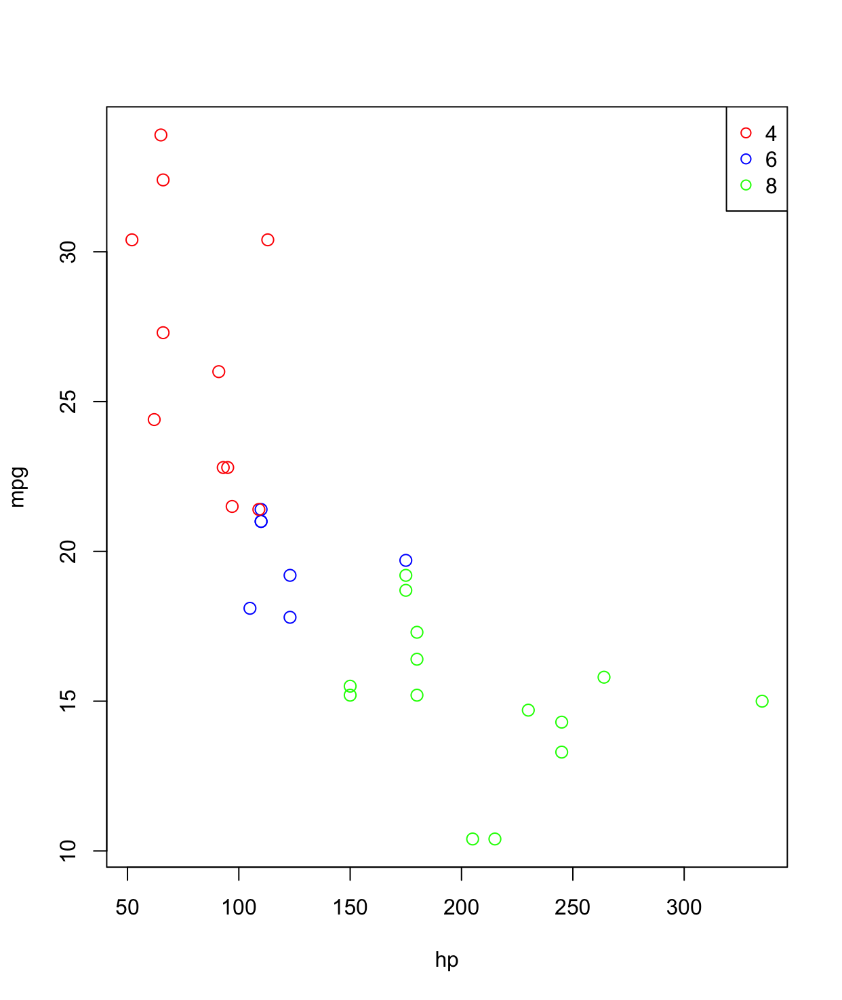{width :50%}

</details>

---

**b .Creating a Simple Scatter Plot**

The above graph can be achived in ggplot2 using the below command

```

ggplot(mtcars, aes(x=hp, y=mpg, color=cyl)) +geom_point(size=3)

```

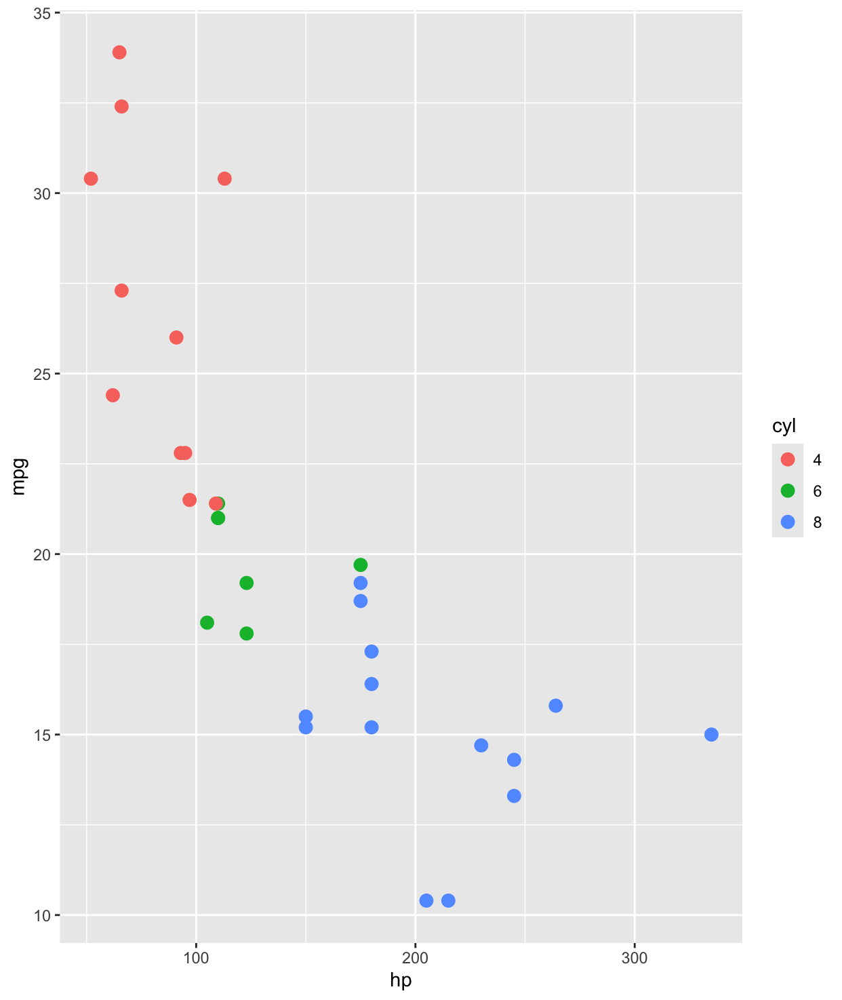{width :50%}

**ggplot2 components**

In total there are 7 Components associated with a ggplot2 of which need input for 3 components from user.

{width :50%}
[source :tidyverse.org](https://ggplot2.tidyverse.org/articles/ggplot2.html#mapping)

the three components 

- data
- mapping
- and a layer

**`+`** is used to add layers,scales and facets to the plot

In the above example; ggplot2 command can be classified into 3 Components

**1. data** : data frame eg mtcars

**2. mapping**  : aes(x=hp, y=mpg) 

**3. layer** : geom_point() adds points to the plot, creating a scatter plot.Sets the size of the points to 3. You can adjust this value to make the points larger or smaller. 


---

**c Customizing the Plot**


***Adding Titles and Labels***

function labs() adds labels to the existing plot. You can set the title, x-axis label, and y-axis label. 

```
ggplot(mtcars, aes(x=hp, y=mpg, color=cyl))+
  geom_point(size=3)+
  labs(
    title = "Scatter Plot of Engine Displacement vs. Highway MPG",
    x = "Engine Displacement (L)",
    y = "Highway MPG"
  )

```

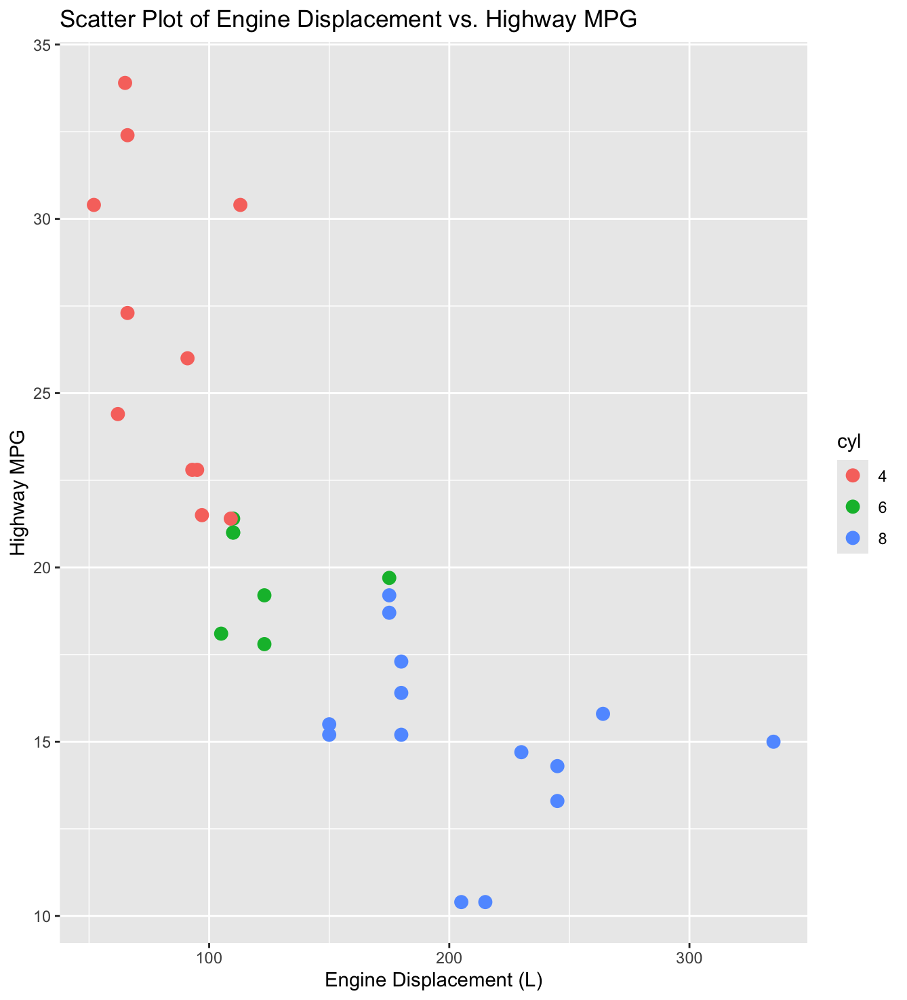{width :50%}


***Adding additional layers***

Smoothed conditional means using function **geom_smooth()** 

```
ggplot(mtcars, aes(x=hp, y=mpg, color=cyl))+
  geom_point(size=3)+
  labs(
    title = "Scatter Plot of Engine Displacement vs. Highway MPG",
    x = "Engine Displacement (L)",
    y = "Highway MPG"
  )+  geom_smooth(method = "lm") 


```

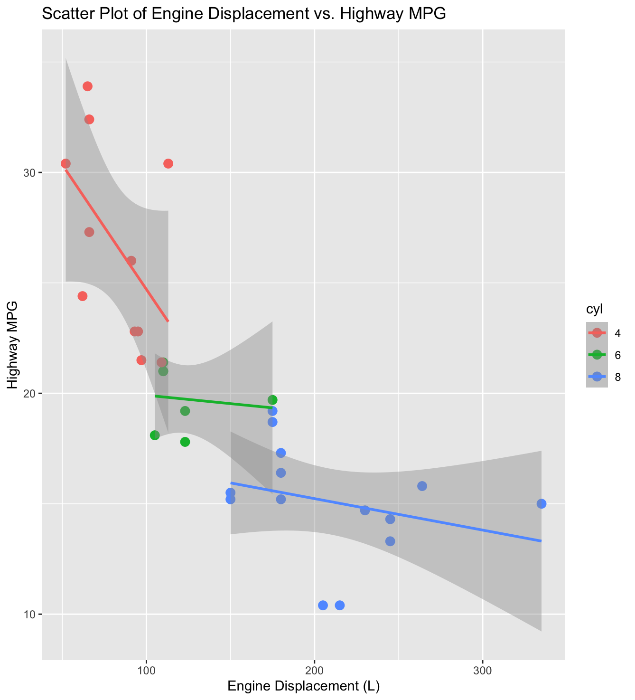{width :50%}

for more arguments and otions related to the function

```
?geom_smooth
  
```

***Faceting***

Faceting allows you to split your data into multiple plots based on a factor variable.

For example if we need to add transmition (manual/automatic) and create a separate images for each

```
ggplot(mtcars, aes(x=hp, y=mpg, color=cyl))+
  geom_point(size=3)+  facet_wrap(~  am ) +
  labs(
    title = "Scatter Plot of Engine Displacement vs. Highway MPG",
    x = "Engine Displacement (L)",
    y = "Highway MPG"
  )+geom_smooth(method = "lm")

```

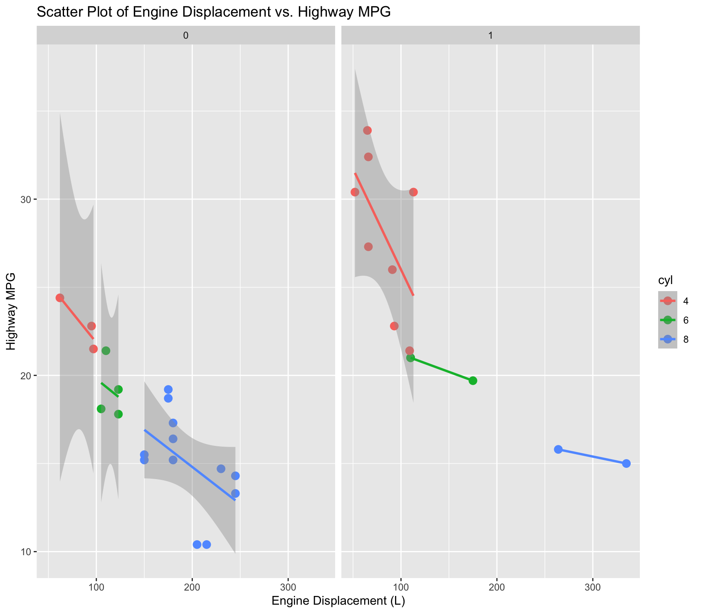{width :50%}


facet_wrap(~ am):

- the tilde (~) operator is used to specify the formula that defines the faceting
- Splits the data into multiple panels based on the am (transmission) variable.
- am is a factor variable indicating the type of transmission (0 = automatic, 1 = manual).
- This means the plot will be divided into two separate scatter plots: one for automatic and one for manual transmission.


**Excercise 2**

Change the labels 0 to "Automatic" & 1 to "Manual" .


<details>
  <summary>Excercise 2 Answer</summary>
  
```
# Creating a New Factor Variable with Labels:

mtcars$transmission <- factor(mtcars$am, labels = c("Automatic", "Manual"))

# Create the plot with the new transmission labels instead of the column am in facet_wrap()

ggplot(mtcars, aes(x = hp, y = mpg, color = cyl)) +
  geom_point(size = 3) +  
  facet_wrap(~ transmission) +
  labs(
    title = "Scatter Plot of Engine Displacement vs. Highway MPG",
    x = "Engine Displacement (L)",
    y = "Highway MPG"
  ) + 
  geom_smooth(method = "lm")
  

```
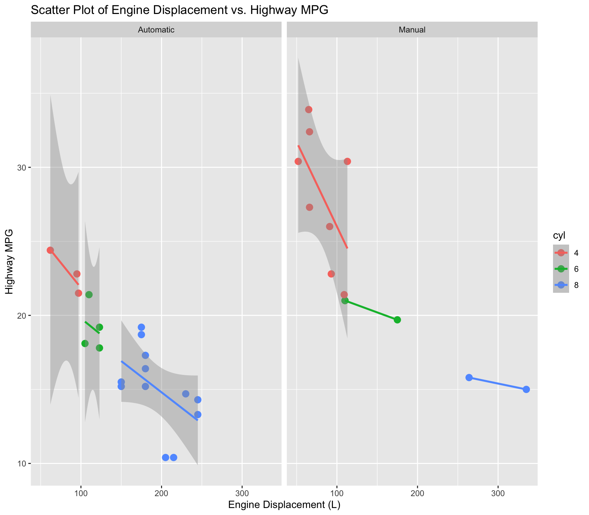{width :50%}


***Its sometimes easy and simple to do manupulations in the datasets to make changes in the plot rather than going for advanced options in the graph***

</details>

***facet_grid***

To add another subset of plots based on second variable

In the example below , facet_grid(vs ~ transmission) creates a grid of panels where each row represents a level of the vs variable and each column represents a level of the transmission variable. This results in a total of four panels in the grid: two for each level of vs (V1 and V2) and two for each level of transmission (Automatic and Manual), forming a 2x2 grid.

```
ggplot(mtcars, aes(x = hp, y = mpg, color = cyl)) +
  geom_point(size = 3) +  
  facet_grid(vs ~ transmission) +
  labs(
    title = "Scatter Plot of Engine Displacement vs. Highway MPG",
    x = "Engine Displacement (L)",
    y = "Highway MPG"
  ) + 
  geom_smooth(method = "lm")


```
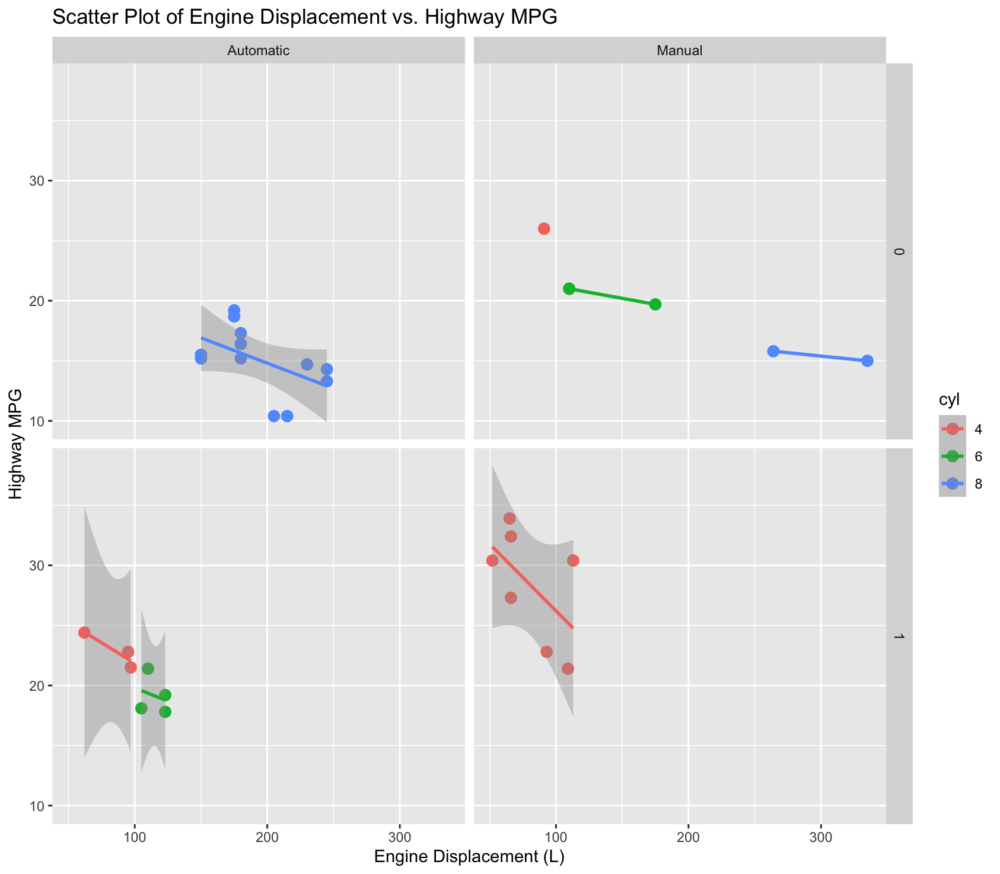{width :50%}

***Themes***

The theme function controls for the look and feel of the plot by customizing the location of legend, colour of the background, gridlines etc. 

ggplot has some built in themes that can be called in using the theme names. Few of them are as follows

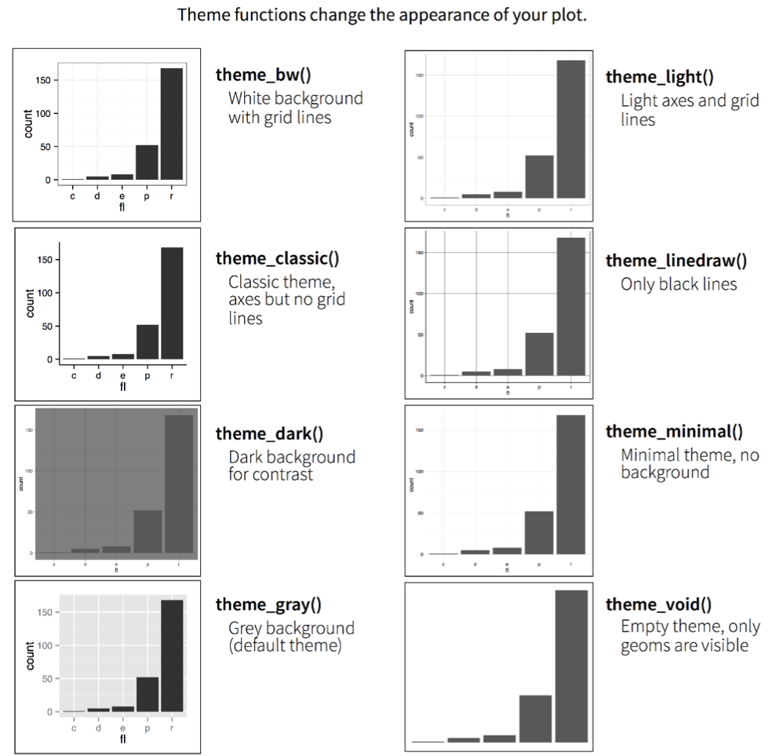{width :50%}

Customizes the appearance of the plot.

```
ggplot(mtcars, aes(x = hp, y = mpg, color = cyl)) +
  geom_point(size = 3) +  
  facet_grid(vs ~ transmission) +
  labs(
    title = "Scatter Plot of Engine Displacement vs. Highway MPG",
    x = "Engine Displacement (L)",
    y = "Highway MPG"
  ) + 
  geom_smooth(method = "lm") + theme(axis.text = element_text(colour = "blue"),legend.position = "top",strip.background = element_rect(colour = "orange", fill = "white"))


```

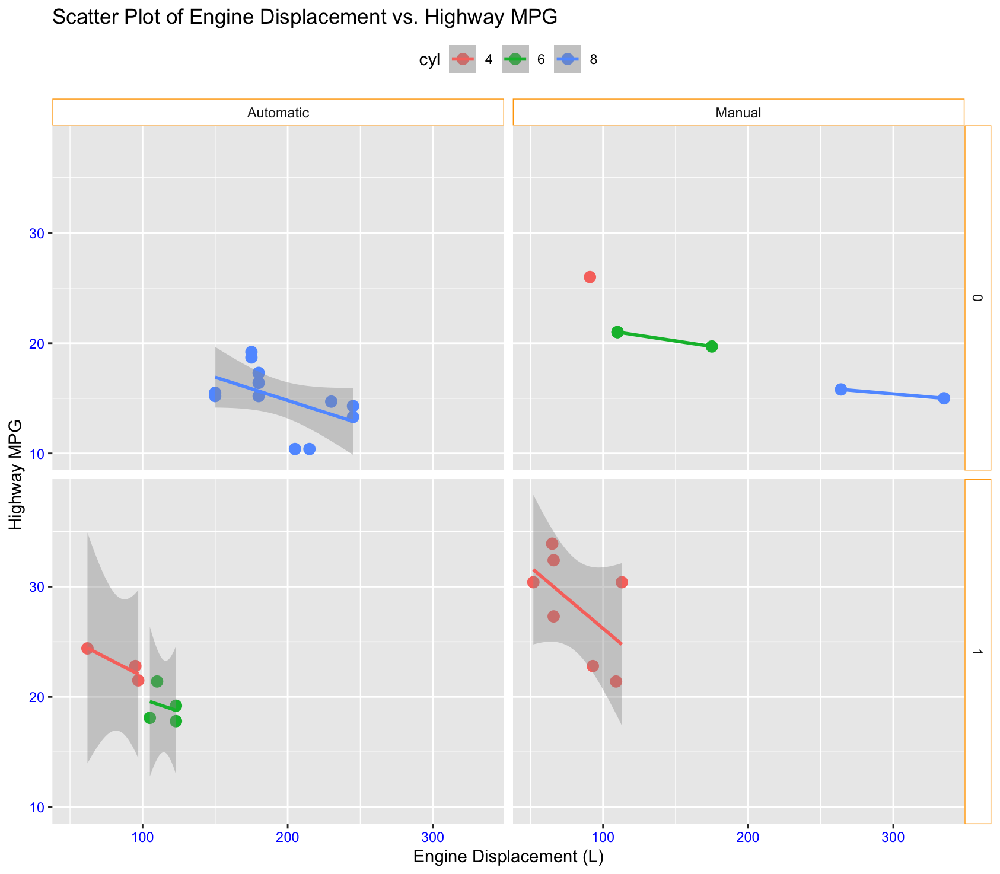{width :50%}


- axis.text = element_text(colour = "blue"): Sets the color of axis text to blue.
- legend.position = "top": Positions the legend at the top of the plot.
- strip.background = element_rect(colour = "orange", fill = "white"): Sets the background color of facet strips to white with an orange border.

for more otions in Customization

```

?theme

```

## Boxplot

geom_boxplot()

```

ggplot(mtcars, aes(x = cyl, y = mpg,color = cyl)) +
  geom_boxplot() +
  labs(
    title = "Box Plot of Miles per Gallon by Number of Cylinders",
    x = "Number of Cylinders",
    y = "Miles per Gallon"
  )

```

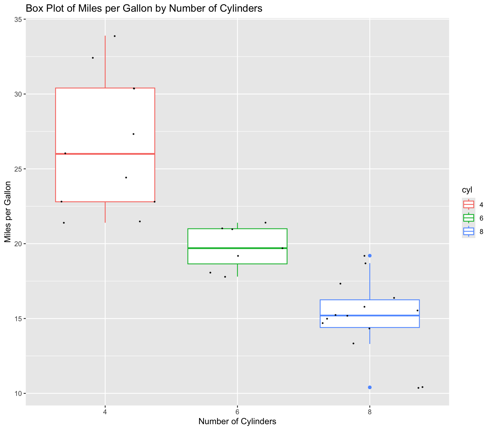{width :50%}

**custome boxplot**

```

ggplot(mtcars, aes(x = cyl, y = mpg,color = cyl)) +
  geom_boxplot(
    
    # custom boxes
    color="blue",
    fill="blue",
    alpha=0.2,
    
    # Notch?
    notch=TRUE,
    notchwidth = 0.8,
    
    # custom outliers
    outlier.colour="red",
    outlier.fill="red",
    outlier.size=3
    
  ) +
  labs(
    title = "Box Plot of Miles per Gallon by Number of Cylinders",
    x = "Number of Cylinders",
    y = "Miles per Gallon"
  )+ geom_jitter(color="black", size=0.4, alpha=0.9) 

```

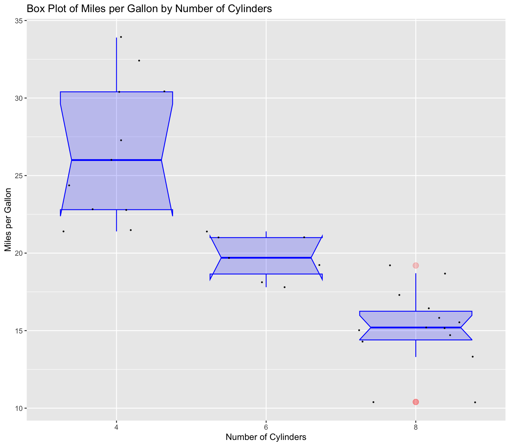{width :50%}

**grouped boxplot**

```
ggplot(mtcars, aes(x = cyl, y = mpg, fill = transmission)) +
  geom_boxplot() +
  labs(
    title = "Box Plot of Miles per Gallon by Number of Cylinders and Transmission Type",
    x = "Number of Cylinders",
    y = "Miles per Gallon",
    fill = "Transmission"
  )
```

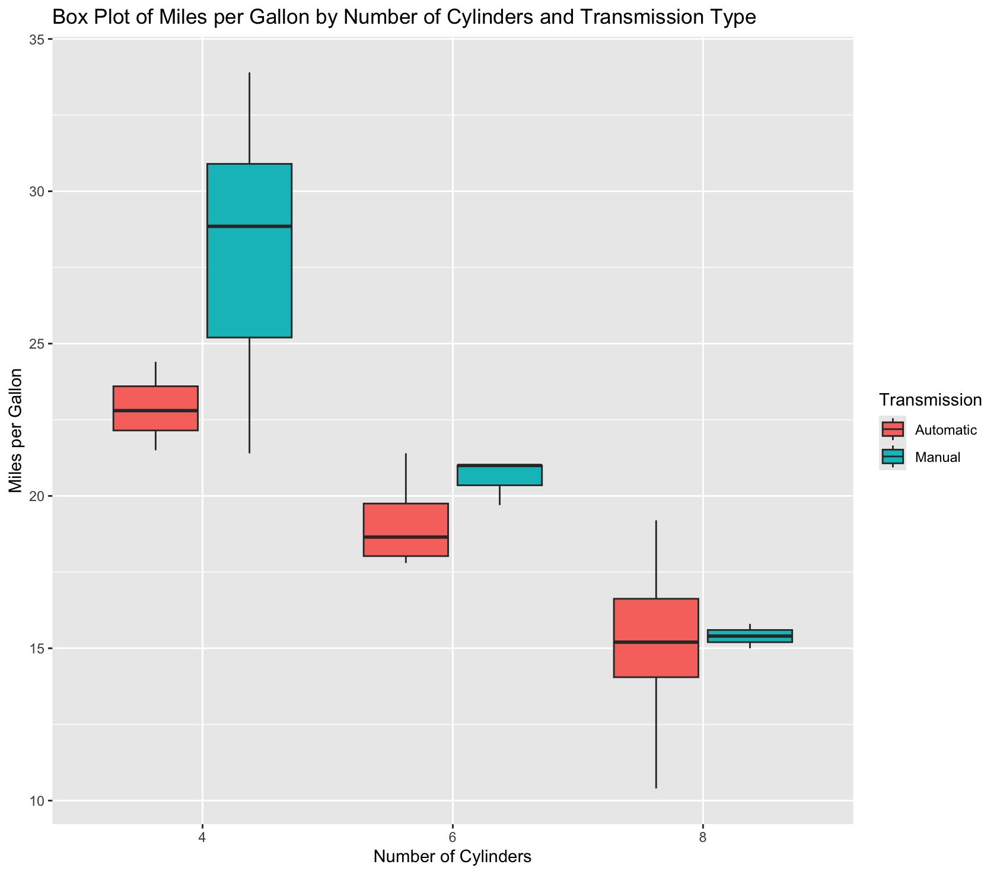{width :50%}

## Create a Violin plot

geom_violin()

```

ggplot(mtcars, aes(x = cyl, y = mpg,color = cyl)) +
  geom_violin() +
  labs(
    title = "Box Plot of Miles per Gallon by Number of Cylinders",
    x = "Number of Cylinders",
    y = "Miles per Gallon"
  )

```


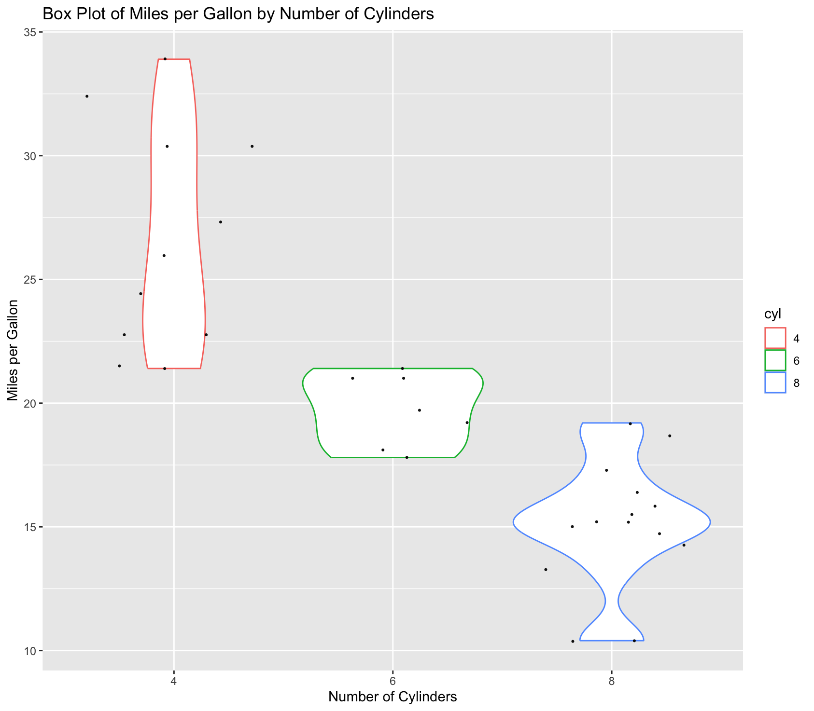{width :50%}


## Density plot

geom_density()

```
ggplot(mtcars, aes(x = mpg,group=transmission, fill=transmission)) +
  geom_density() +
  labs(
    title = "Density Plot of Miles per Gallon",
    x = "Miles per Gallon",
    y = "Density"
  )
```


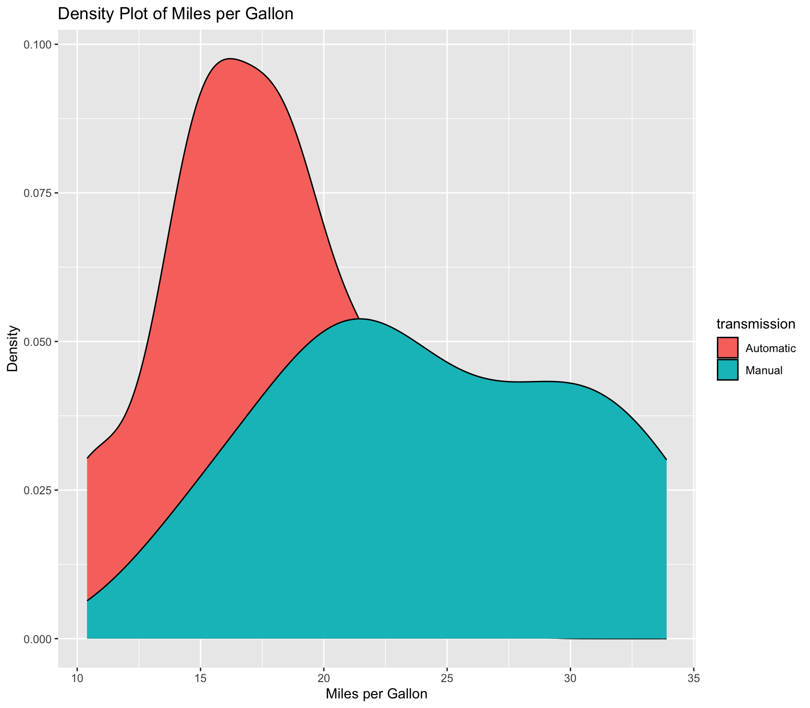{width :50%}


**ggextra**

Create a ggplot2 scatterplot with marginal density plots (default) or histograms, or add the marginal plots to an existing scatterplot.

 

```
install.packages("ggExtra")
library(ggExtra)

# Load necessary packages
library(ggplot2)
library(ggExtra)

# Convert 'cyl' to a factor
mtcars$cyl <- as.factor(mtcars$cyl)

# Create the scatter plot with color grouping by 'cyl'
p <- ggplot(mtcars, aes(x = hp, y = mpg, color = cyl)) +
  geom_point(size = 3) +
  labs(
    title = "Scatter Plot of Horsepower vs. Miles per Gallon",
    x = "Horsepower",
    y = "Miles per Gallon",
    color = "Cylinders"
  ) 

# Add marginal density plots
ggMarginal(p, type = "density", groupFill = TRUE)
```
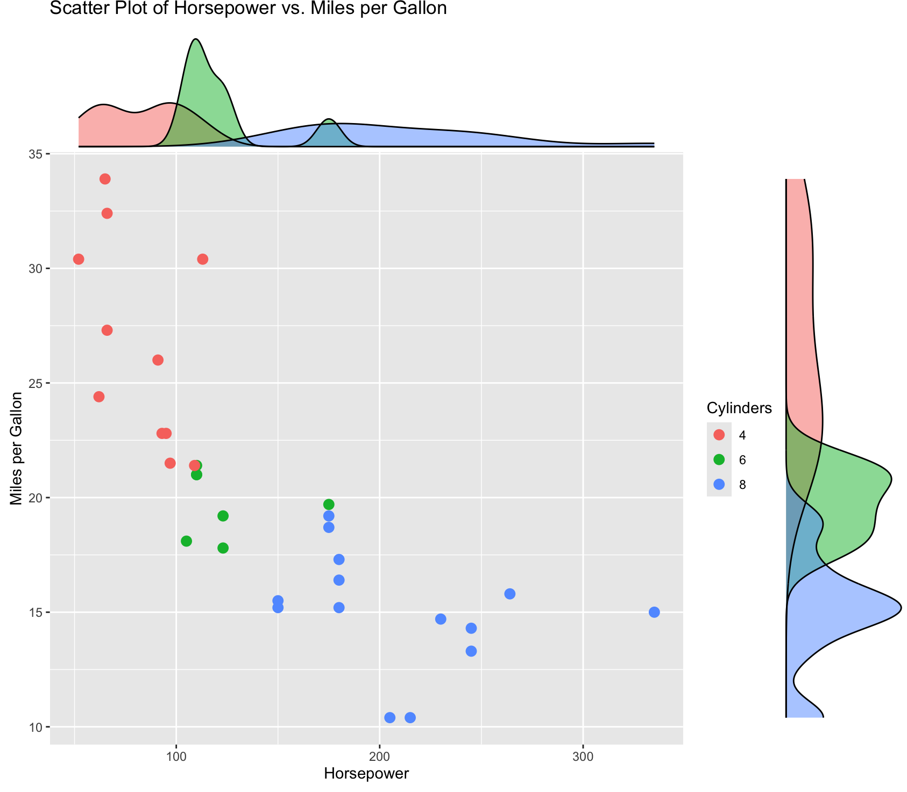{width :50%}

**BarPlot**

```
bar <- ggplot(data = diamonds) + 
  geom_bar(
    mapping = aes(x = cut, fill = cut), 
    show.legend = FALSE,
    width = 1
  ) + 
  theme(aspect.ratio = 1) +
  labs(x = NULL, y = NULL)

bar

```

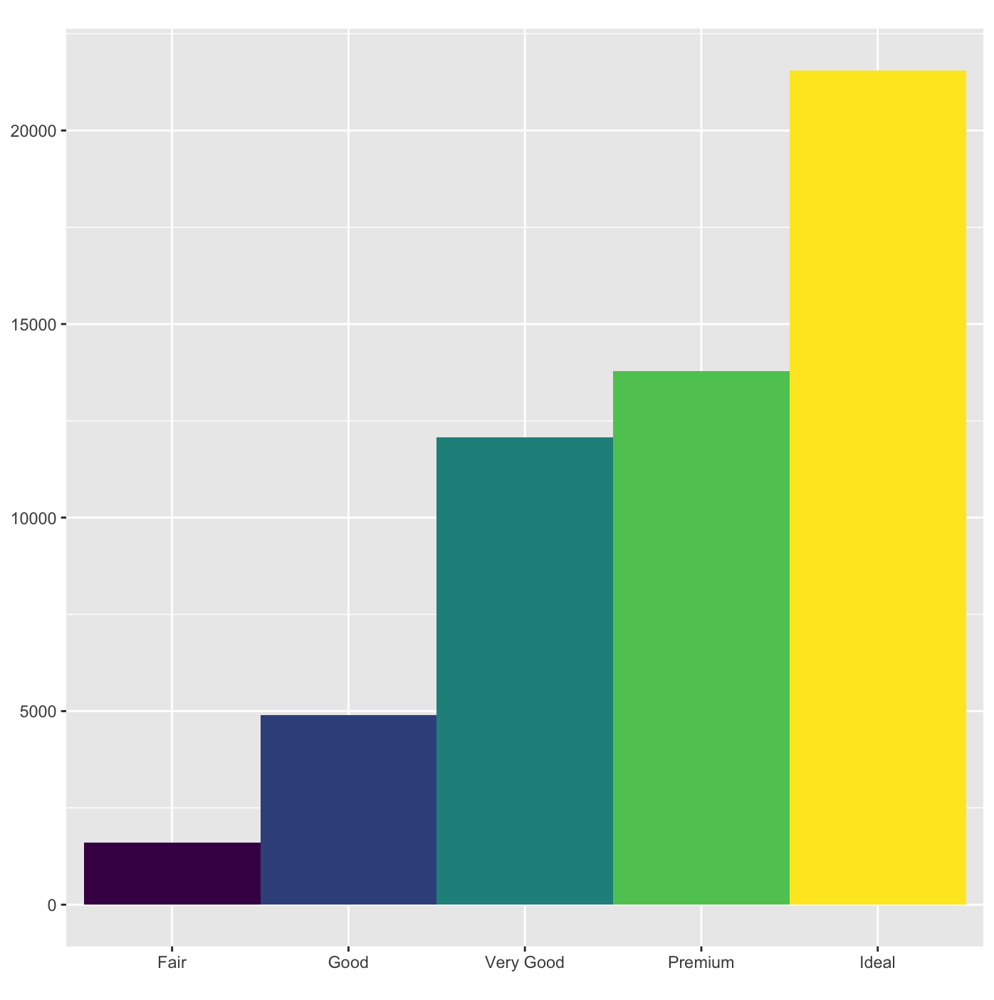{width :50%}

fliping the plot

```
bar + coord_flip()

```
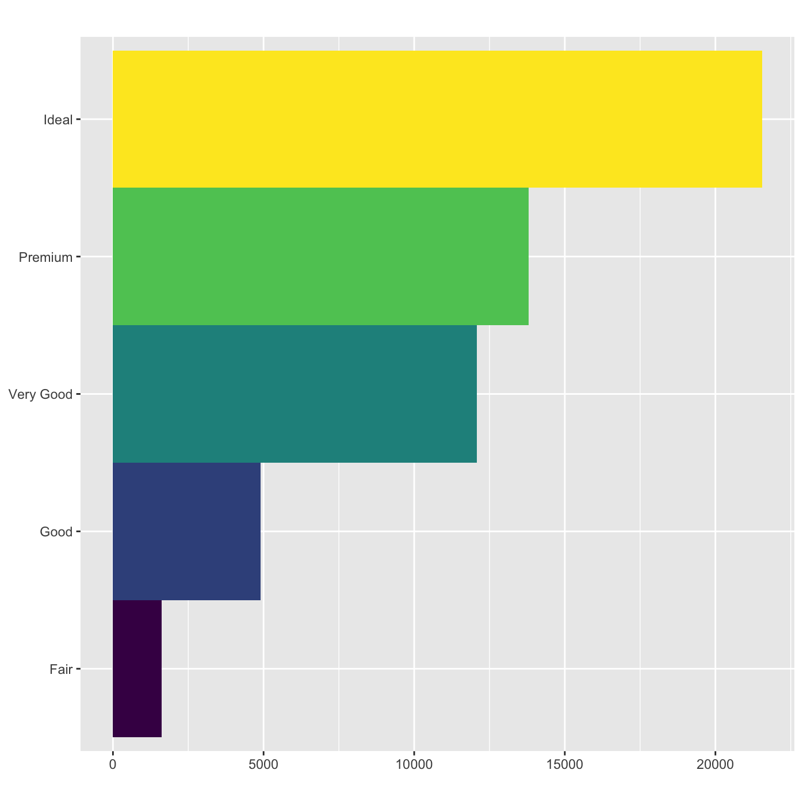{width :50%}

stacked bar chart in polar style

```

bar + coord_polar()

```

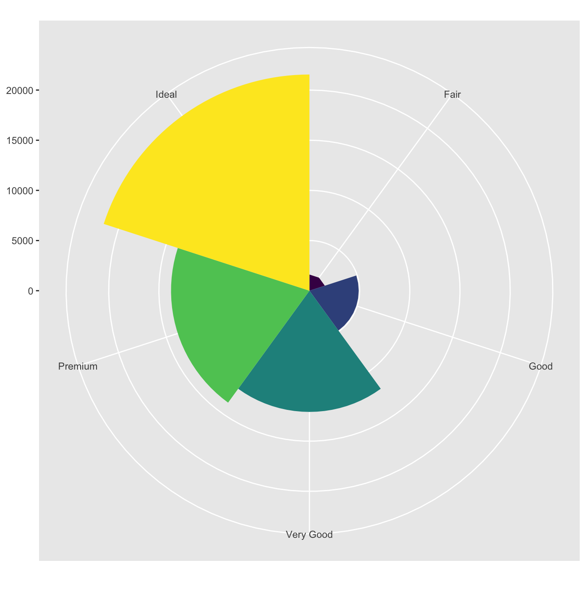{width :50%}


**Heatmap**

```

## Reload the mtcars and scale the values
df <- scale(mtcars)
heatmap(df, scale = "none")

```

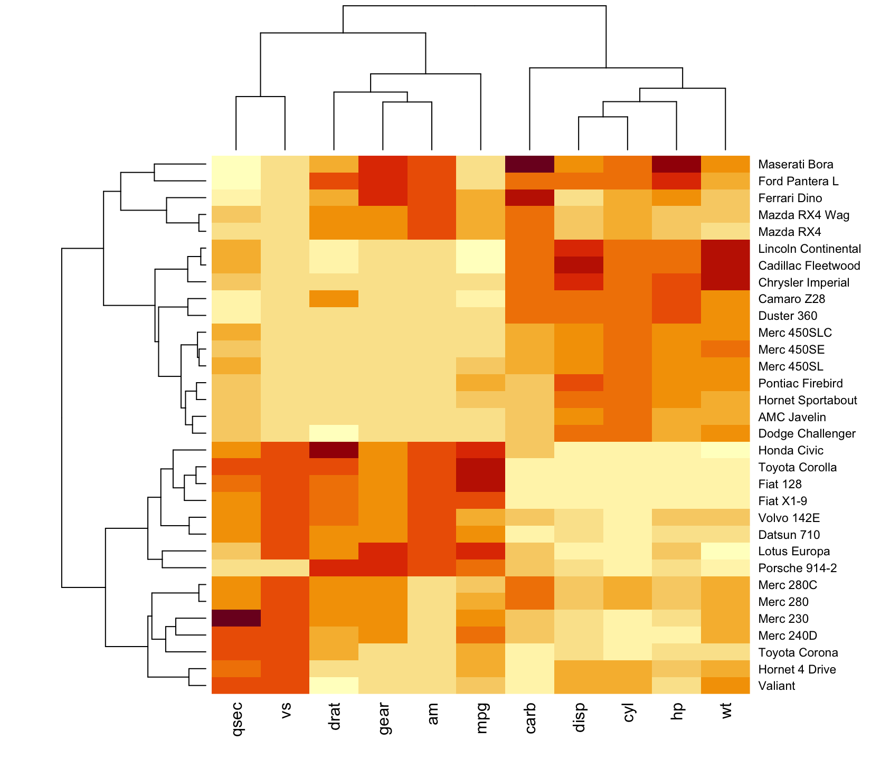{width :50%}


**Complex Heatmap***

Complex heatmaps are efficient to visualize associations between different sources of data sets and reveal potential patterns. [More info](https://jokergoo.github.io/ComplexHeatmap-reference/book/introduction.html)


---


